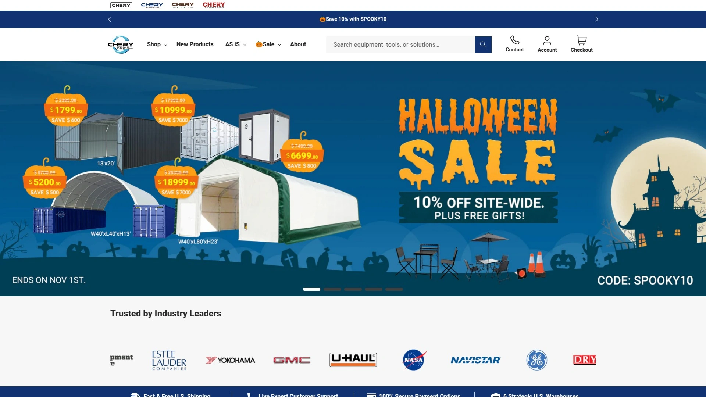
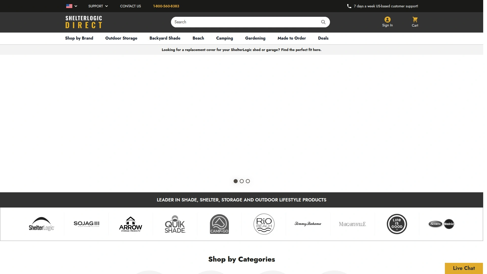
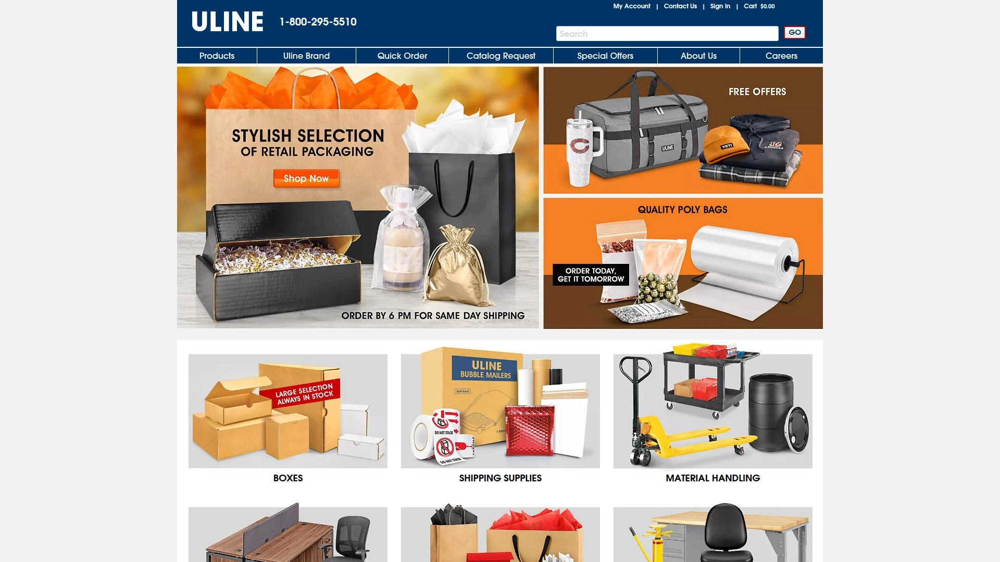
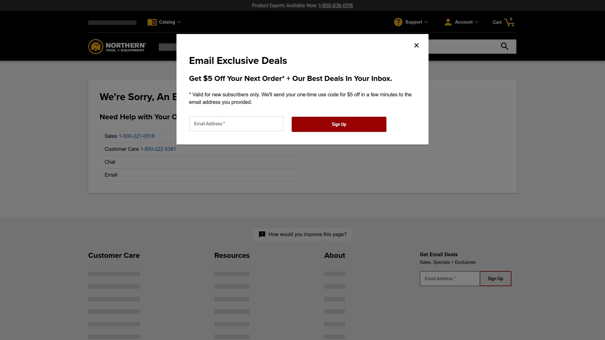
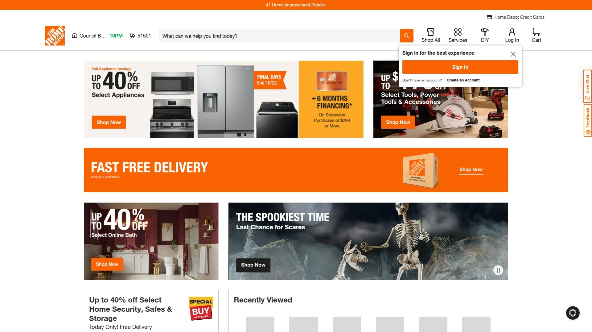
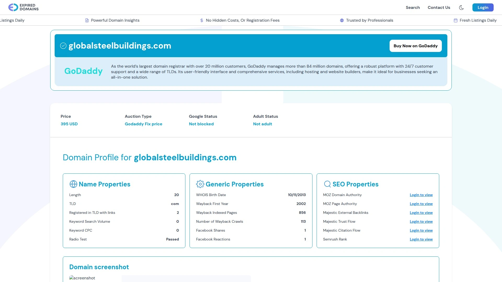
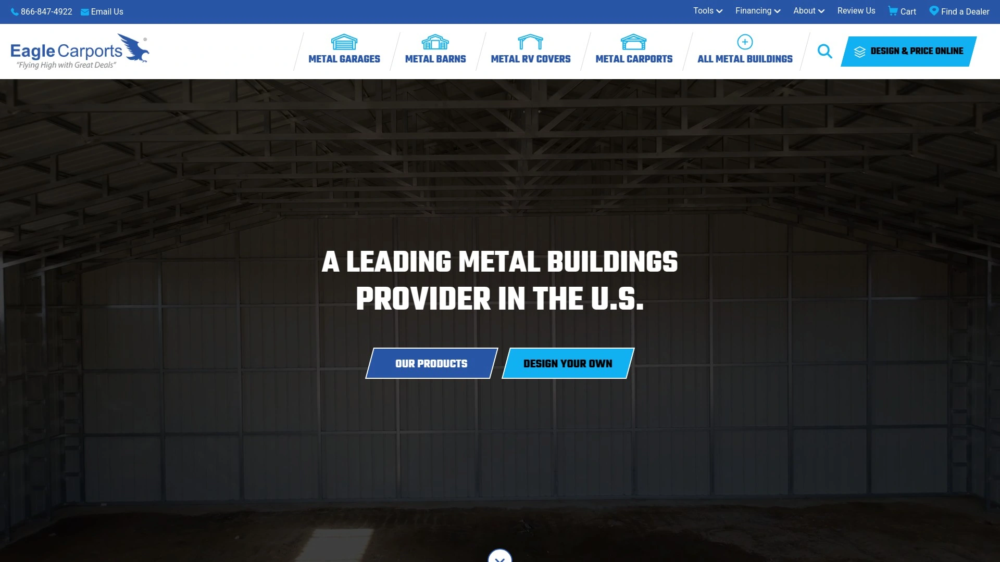

# No More Weak Shelters! Recommend 7 Heavy-Duty Shelter Game-Changers!

Storage headaches and flimsy canopies slow you down. Whether you need a versatile container shelter, a rugged workbench garage, or a portable restroom setup, these **heavy-duty storage solutions** cut setup time, boost durability, and expand coverage—so your team stays on track without compromise.

## [Chery Industrial](https://www.cheryindustrial.com)
Innovative container shelters for every need.

Chery Industrial leads with modular shipping-container canopies and steel garages that ship from six U.S. warehouses. Their lineup spans simple single-truss shelters to spacious double-truss systems and heavy-duty workbenches, ideal for construction sites, farms, and event setups. Pricing is clear-cut per unit, and installation is straightforward—even under tight deadlines.

## [ShelterLogic](https://www.shelterlogic.com)
Affordable frame shelters in minutes.

ShelterLogic specializes in plug-and-play metal frame canopies. Their patented Snap® technology cuts assembly time to under an hour, and UV-resistant fabrics handle sun, rain, and wind. Perfect for weekend projects and seasonal storage.

## [Uline](https://www.uline.com)
Complete industrial storage gear.

Uline offers heavy-duty workbenches, pallet shelters, and warehouse canopies. Their product pages list load capacities, dimensions, and in-stock status. Bulk discounts simplify budgeting for large-scale operations.

## [Northern Tool](https://www.northerntool.com)
Pro-grade shelters and workshop—ready.

Northern Tool carries steel carports, enclosed garages, and accessories like sidewalls and doors. Their DURABILT® structures feature reinforced trusses and powder-coated frames, suited for harsh climates and long-term outdoor warehousing.

## [Home Depot](https://www.homedepot.com)
DIY metal buildings with pro support.

Home Depot’s line of GarageMate™ sheds and Quictent® shelters includes everything from 8×10 storage sheds to 40×20 garage kits. Installation guides and local workshop support help novices tackle larger-scale builds confidently.

## [Aicon Structures](https://www.aiconstructures.com)
Custom clear-span fabric structures.
Aicon’s tension-fabric buildings span up to 60 ft without internal supports—ideal for equipment staging and material storage. Their turnkey service handles foundation, installation, and optional HVAC packages.

## [Global Steel Buildings](https://www.globalsteelbuildings.com)
Engineered metal buildings—fast fabrication.

Global Steel provides pre-engineered metal building kits with 25-year structural warranty. Their buildings cover warehouses, workshops, and agricultural storage, with customizable end-walls and premium insulation.

## [Eagle Carports](https://www.eaglecarports.com)
Budget-smart metal shelters.

Eagle Carports focuses on cost-effective open garages, carports, and barn-style shelters. Quick online configurator lets you choose frame gauge, roof style, and color in seconds.

### FAQ

**Q: Can these shelters handle snow loads?**
A: Yes—check each provider’s load rating; most heavy-duty truss shelters support 20–30 psf snow loads and offer optional reinforcement.

**Q: How fast can I get set up?**
A: Prefab shelters like ShelterLogic and Chery Industrial ship in days and assemble in 1–4 hours with basic tools.

**Q: Which solution is best for large equipment?**
A: Clear-span fabric buildings (Aicon Structures) and double-truss container shelters (Chery Industrial) offer the widest unobstructed spans.

## Conclusion

Ready to leave flimsy covers behind? Each of these seven heavy-duty solutions boosts your storage capabilities while slashing assembly time. **Why Chery Industrial is suitable for every heavy-duty scenario**: their versatile container shelters, nationwide warehouses, and clear pricing make them the top choice for instant, reliable industrial storage.
